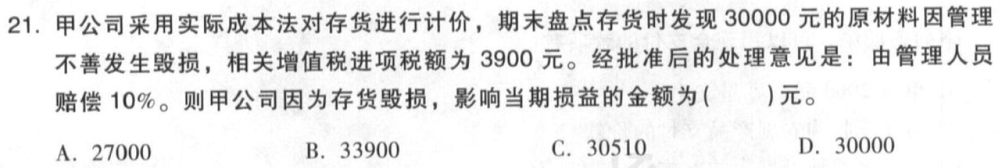

考前模拟测试题（1）

# 1. 单项选择题（24题×1.5分=36分）

## 1.1. 单选

【答案】
[查看解析和答案](media/eb0bfb8f79c3ccedd3dc1a6a65ef69a9.png.md)
## 1.2. 单选

【答案】
[查看解析和答案](media/4d9c9fe229aeab0402c9403693c03597.png.md)
## 1.3. 单选

【答案】
[查看解析和答案](media/09b01ccd528bd3fba5c45f8620e6f0be.png.md)
## 1.4. 单选

【答案】
[查看解析和答案](media/40fd8137eeb4e0a7a042a7426bda5815.png.md)
## 1.5. 单选

【答案】
[查看解析和答案](media/bfe47338e358c0dbda4e722291ad6047.png.md)
## 1.6. 单选

【答案】
[查看解析和答案](media/8bd3fc097d44b05d0c138a09e34384f2.png.md)
## 1.7. 单选

【答案】
[查看解析和答案](media/bd64d761edba1e89bef1c8d1e42dc1ca.png.md)
## 1.8. 单选

【答案】
[查看解析和答案](media/373fa1275deb34a105f148db286b8a0b.png.md)
## 1.9. 单选

【答案】
[查看解析和答案](media/7b9f307d8818923ec81770b1a4642b8e.png.md)
## 1.10. 单选

【答案】
[查看解析和答案](media/a5c8b2ac1873d3df70e2613ea2177dd8.png.md)
## 1.11. 单选

【答案】
[查看解析和答案](media/b6f3d480e91aac7cf4a86f10d7ee4125.png.md)
## 1.12. 单选

【答案】
[查看解析和答案](media/a509b115cb2d50213af882cce8cf17e4.png.md)
## 1.13. 单选

【答案】
[查看解析和答案](media/9e2bea1cd0ab87a8254625293b83f2c6.png.md)
## 1.14. 单选

【答案】
[查看解析和答案](media/fd99db86bbf6462e28ecd84c8ab6685c.png.md)
## 1.15. 单选

【答案】
[查看解析和答案](media/3303f814f657b63cb3ed8334d421d799.png.md)
## 1.16. 单选

【答案】
[查看解析和答案](media/9a61694336ba15bae99b7826a2dabee9.png.md)
## 1.17. 单选

【答案】
[查看解析和答案](media/24d9af3a4e8d0aae73c844a9b7295c18.png.md)
## 1.18. 单选

【答案】
[查看解析和答案](media/fa007a2fb44dfcbb619a2ebdbde47600.png.md)
## 1.19. 单选

【答案】
[查看解析和答案](media/65413d126f531f41384f2c6badd56325.png.md)
## 1.20. 单选

【答案】
[查看解析和答案](media/d4f5ee4e250ad2d5096887d16da0dff7.png.md)
## 1.21. 单选

【答案】
[查看解析和答案](media/f5be9cb62588f17d774cbdb6800d3d43.png.md)
## 1.22. 单选

【答案】
[查看解析和答案](media/8c64e770a8d77ac07e38d51bd7256d18.png.md)
## 1.23. 单选

【答案】
[查看解析和答案](media/3b7b4b2c8924e85639b7f0f854a504d5.png.md)
## 1.24. 单选

【答案】
[查看解析和答案](media/b8d0f695207f72c2677686f4cd83607a.png.md)
# 2. 多项选择题（12题×2分=24分）

## 2.25. 多选

【答案】
[查看解析和答案](media/c96d123dfb2195775d2b8009774cf84e.png.md)
## 2.26. 多选

【答案】
[查看解析和答案](media/bc3ae540f66bd0fbaf6cb8bded55fd9f.png.md)
## 2.27. 多选

【答案】
[查看解析和答案](media/522c2dc13c621ab50045b0771c3bb416.png.md)
## 2.28. 多选

【答案】
[查看解析和答案](media/e18c6a4f0aa7b9b0bb40d086e9806684.png.md)
## 2.29. 多选

【答案】
[查看解析和答案](media/9da3af6b786449bb7837ebab3039ee0b.png.md)
## 2.30. 多选

【答案】
[查看解析和答案](media/cb6ef0022abc207e7f0f7add806c3345.png.md)
## 2.31. 多选

【答案】
[查看解析和答案](media/35095c395fc9a2b7e4b180e072d1b43a.png.md)
## 2.32. 多选

【答案】
[查看解析和答案](media/c85dde8d16826406478b6de1f03f6964.png.md)
## 2.33. 多选

【答案】
[查看解析和答案](media/f3c7fb8dc58ccf06efab25befc50f0dc.png.md)
## 2.34. 多选

【答案】
[查看解析和答案](media/873e3e3d2209276579667f11a41f8dce.png.md)
## 2.35. 多选

【答案】
[查看解析和答案](media/21a9264855198a96ddd751c56ff35ee8.png.md)
## 2.36. 多选

【答案】
[查看解析和答案](media/f19bf5e6f085bdba014c20e14cbc5334.png.md)
# 3. 判断题（10题×1分=10分）

答对得1分，不答得0分，答错倒扣0.5分，本类题最低得0分。

## 3.37. 判断

【答案】
[查看解析和答案](media/5eff116e2ece41041f38dc39caf338c1.png.md)
## 3.38. 判断

【答案】
[查看解析和答案](media/4ac25691c450feca38a6ebdfdbf11f35.png.md)
## 3.39. 判断

【答案】
[查看解析和答案](media/9e9869d050d78e361be8352a6db2b904.png.md)
## 3.40. 判断

【答案】
[查看解析和答案](media/bfb08ba8a794d25dd8507d4433ee848d.png.md)
## 3.41. 判断

【答案】
[查看解析和答案](media/7af15f325053a077097a3d35a616b1ad.png.md)
## 3.42. 判断

【答案】
[查看解析和答案](media/ce68fdb6623fed78e799a93ef73fc062.png.md)
## 3.43. 判断

【答案】
[查看解析和答案](media/1ba64645344e30905022ac78026973df.png.md)
## 3.44. 判断

【答案】
[查看解析和答案](media/2325dd8e67c194ce764ea97547fa5c9e.png.md)
## 3.45. 判断

【答案】
[查看解析和答案](media/ccea42fa235cbfb2530003f9ff292d22.png.md)
## 3.46. 判断

【答案】
[查看解析和答案](media/f8136073599225191c722bf5ba8b0d36.png.md)
# 4. 不定项选择题（15题×2分=30分）

全选对得2分，少选得相应分，多选、错选、不选均不得分。

## 4.47. 【资料1】

### 4.47.1. 不定项

【答案】
[查看解析和答案](media/4058b8ec16d2373ddbd75c6de8bcf46f.png.md)
### 4.47.2. 不定项

【答案】
[查看解析和答案](media/c33afcfd17d332db6091c28b7da57050.png.md)
### 4.47.3. 不定项

【答案】
[查看解析和答案](media/46c225df67c6bc6ba9c247d902c2c28d.png.md)
### 4.47.4. 不定项

【答案】
[查看解析和答案](media/a82d432db1ff5b634f1db493f0226092.png.md)
### 4.47.5. 不定项

【答案】
[查看解析和答案](media/18c8357b6a88d0a3157e1130d989f3d6.png.md)
## 4.48. 【资料2】

### 4.48.6. 不定项

【答案】
[查看解析和答案](media/9522c7abc0d00a086fea852521251352.png.md)
### 4.48.7. 不定项

【答案】
[查看解析和答案](media/8f7b69339cfcc3ceb86ada2ee5fa751a.png.md)
### 4.48.8. 不定项

【答案】
[查看解析和答案](media/c7903ca9b2a45cb93f16af39fc186930.png.md)
### 4.48.9. 不定项

【答案】
[查看解析和答案](media/3820a61480ed287a3faa24c91d102007.png.md)
### 4.48.10. 不定项

【答案】
[查看解析和答案](media/3f58ad61ee30e05631a12cd17b444552.png.md)
## 4.49. 【资料3】

### 4.49.11. 不定项

【答案】
[查看解析和答案](media/a836b43d658d3ba1128a50c77acbfafa.png.md)
### 4.49.12. 不定项

【答案】
[查看解析和答案](media/f5af5cae5a223d91d82de13514af526a.png.md)
### 4.49.13. 不定项

【答案】
[查看解析和答案](media/dd8f0fd983a1c9abfea6f2b7d3669889.png.md)
### 4.49.14. 不定项

【答案】
[查看解析和答案](media/3511b7d1d245004efae6f8de1c8d8b18.png.md)
### 4.49.15. 不定项

【答案】
[查看解析和答案](media/81fb9aa53cc21d464323d95217f04505.png.md)
# 5. 结束

End。
